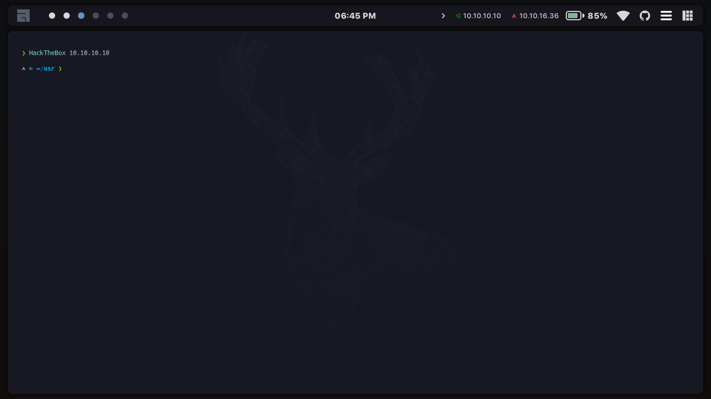
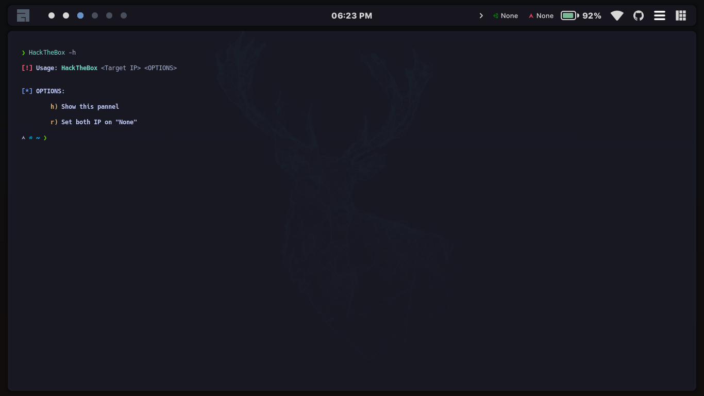

## Index

- [**Screenshots**](##Screenshots)
- [**Introduction**](##Introduction)
- [**Pre-requisites**](##Pre-requisites)
- [**Installation**](##Installation)

## Screenshots




## Introduction

This plugin is a tool for HackTheBox which allows you to see your own VPN IP and set an IP as a target. The bash script can be modified for be used as a daemon. You can search in google how to do that and feel free to ask me if you want to do it and you dont know how.

## Pre-requisites

First of all you need Awesome WM, im using the AwesomeWM config of [rxyhn](https://github.com/rxyhn/dotfiles/). Actually i dont know if you can use this plugins with other config of AwesomeWM cause proably other configs have other folders like this, but also feel free to ask :). Then the requisites are:

- AwesomeWM (rxyhn config)
- xdotool

## Installation

1. First of all you need to add the following code to your `~/.config/awesome/configuration/keys.lua` in "Global Keybindings"
```lua
-- Add in ~/.config/awesome/configuration/keys.lua
  awful.key({ shift, ctrl, alt }, "9", awesome.restart, { description = "reload awesome", group = "WM" }),
```

2. Second you need to clone this repository:
```
git clone https://github.com/0xnarf/AwesomeWM-HTB-Plugin
```

3. Next, we are going to install the plugins:

```
mkdir ~/.config/awesome/ui/widgets
cp -r ./ui/widgets/* ~/.config/awesome/ui/widgets/
cp ./ui/bar/init.lua ~/.config/awesome/ui/bar/init.lua
xdotool key shift+ctrl+alt+9 &>/dev/null
```
4. Finally, we need to install the bash script in our path:
```
sudo ln -sf ./HackTheBox.sh /usr/bin/HackTheBox
```

